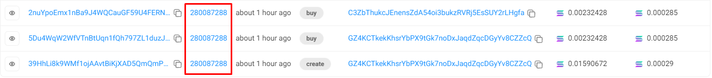

# 🚀 Pumpfun Bundler SDK

## Overview

**Pumpfun Bundler SDK** is the fastest and most efficient self-bundling script for [Pump.fun](https://pump.fun), enabling you to **create a token** and simulate market activity by purchasing it with **25 wallet addresses in a single bundle**. Perfect for creators aiming to streamline token deployment and bootstrapped buying activity.

---

## 🛠 Installation

```bash
npm install pumpdotfun-sdk
```

---

## ⚙️ Usage Example

### Step 1: Configure Environment

Create a `.env` file based on `.env.example`, and set your RPC URL:

```env
HELIUS_RPC_URL=https://your-rpc-endpoint
```

### Step 2: Fund Wallet

The script generates a new keypair. Ensure it has **at least 0.004 SOL** to cover network fees.

### Step 3: Customize Token Metadata

Edit the following metadata before running the script:

```ts
const metadata = {
  name: "Bolt token",
  symbol: "Bolt",
  description: "Brave Veer & Bolt",
  image: "./upload/img.jpg",
  showName: true,
  createdOn: "https://pump.fun",
  twitter: "https://x.com/pepa_inu",
  telegram: "https://t.me/pepaonsols",
  website: "https://www.pepa-inu.com"
};
```

### Step 4: Run the Script

```bash
npx ts-node example/basic/index.ts
```

---

## 🔍 Example Output

* **PumpFun Token Page**:
  [View on Pump.fun](https://pump.fun/2q4JLenwD1cRhzSLu3uPMQPw4fTEYp7bLtfmBwFLb48v)

* **Solscan Link**:
  

---

## 📘 SDK Methods: `PumpDotFunSDK`

### `createAndBuy()`

Creates and purchases your token in one transaction.

```ts
async createAndBuy(
  creator: Keypair,
  mint: Keypair,
  createTokenMetadata: CreateTokenMetadata,
  buyAmountSol: bigint,
  slippageBasisPoints?: bigint,
  priorityFees?: PriorityFee,
  commitment?: Commitment,
  finality?: Finality
): Promise<TransactionResult>
```

---

### `buy()`

Buys a token from Pump.fun.

```ts
async buy(
  buyer: Keypair,
  mint: PublicKey,
  buyAmountSol: bigint,
  slippageBasisPoints?: bigint,
  priorityFees?: PriorityFee,
  commitment?: Commitment,
  finality?: Finality
): Promise<TransactionResult>
```

---

### `sell()`

Sells a specific token amount.

```ts
async sell(
  seller: Keypair,
  mint: PublicKey,
  sellTokenAmount: bigint,
  slippageBasisPoints?: bigint,
  priorityFees?: PriorityFee,
  commitment?: Commitment,
  finality?: Finality
): Promise<TransactionResult>
```

---

### `addEventListener()`

Subscribes to Pump.fun protocol events.

```ts
addEventListener<T extends PumpFunEventType>(
  eventType: T,
  callback: (event: PumpFunEventHandlers[T], slot: number, signature: string) => void
): number
```

---

### `removeEventListener()`

Removes a previously registered event listener.

```ts
removeEventListener(eventId: number): void
```

---

## 🧪 Running the Examples

### Basic Token Launch

```bash
npx ts-node example/basic/index.ts
```

---

## 📡 Event Subscription Example

Monitor `createEvent`, `tradeEvent`, and `completeEvent` from the blockchain.

### File: `example/events/events.ts`

```ts
import dotenv from "dotenv";
import { Connection, Keypair } from "@solana/web3.js";
import { PumpFunSDK } from "pumpdotfun-sdk";
import NodeWallet from "@coral-xyz/anchor/dist/cjs/nodewallet";
import { AnchorProvider } from "@coral-xyz/anchor";

dotenv.config();

const getProvider = () => {
  if (!process.env.HELIUS_RPC_URL) {
    throw new Error("Please set HELIUS_RPC_URL in .env file");
  }

  const connection = new Connection(process.env.HELIUS_RPC_URL);
  const wallet = new NodeWallet(new Keypair());
  return new AnchorProvider(connection, wallet, { commitment: "finalized" });
};

const setupEventListeners = async (sdk) => {
  const createEventId = sdk.addEventListener("createEvent", (event, slot, signature) => {
    console.log("createEvent", event, slot, signature);
  });

  const tradeEventId = sdk.addEventListener("tradeEvent", (event, slot, signature) => {
    console.log("tradeEvent", event, slot, signature);
  });

  const completeEventId = sdk.addEventListener("completeEvent", (event, slot, signature) => {
    console.log("completeEvent", event, slot, signature);
  });

  console.log("Subscribed to events:", { createEventId, tradeEventId, completeEventId });
};

const main = async () => {
  try {
    const provider = getProvider();
    const sdk = new PumpFunSDK(provider);
    await setupEventListeners(sdk);
  } catch (error) {
    console.error("An error occurred:", error);
  }
};

main();
```

### Run the Event Listener

```bash
npx ts-node example/events/events.ts
```

---

## 🤝 Contributing

Contributions are welcome!
Feel free to submit a pull request or open an issue to suggest improvements or report bugs.

---

## 📬 Contact

Telegram: [aimasterdev](https://t.me/aimasterdev)

--
